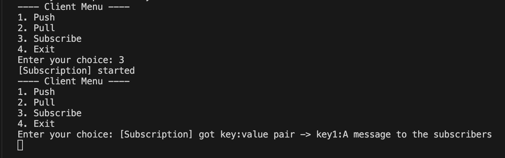

# Message_Broker
Message_Broker is a queueing system which consists of a load balancer module that further distibutes
the incoming reuqests to the online worker nodes. </br>
 We have containerized our modules using docker and each of the nodes in the cluster or the load balancers can be deployed and ran independently and isolated.

## Clients
We have two client programs, one of them written in python and the other written in java. They have the same functionalities. You can either:
 - push 
 - pull
 - subscribe

to the single available queue at server-side. 
### Push
A client can send a (key, value) pair to the server. The load balancer then notifies the cluster of the newly arrived message.
### Pull
When a client pulls from server, the response consists of the latest unread message from the queue, a key-value pair. 

 Here  is an example of pushing key0:VAL pair to the queue, and then retrieving it by a pull request to the server.</img>


### Subscribe
When a client subscribes to the queue, a new thread runs an constantly pulls from the server to receive new messages from the queue.

 After pushing and pulling in the previous image, here we have subscribed to the queue. Then when another client pushes a new message, we receive that (as shown in the image).</img>

 This is another client instance which has sent a message to the queue. As shown in the previous image, our subscriber client successfully receives this message.</img>

### Running Client Instances
To run a client instance, in either of the java and python version, you have to specify two addresses to the load balancers with which the client tries to communicate later on.
- python:
```shell
python3 client/python/client.py 127.0.0.1:12345 127.0.0.1:12346 
```
- java (>11):
```shell
java client/java/java/Main.java 127.0.0.1:12345 127.0.0.1:12346
```
In both of the cases, `127.0.0.1:12345` is the address of primary load balancer and `127.0.0.1:12346` is the address of the back-up load balancer.

## Load Balancer
In this system, we have two load balancers, a master and a back-up. 

## Cluster

## CICD